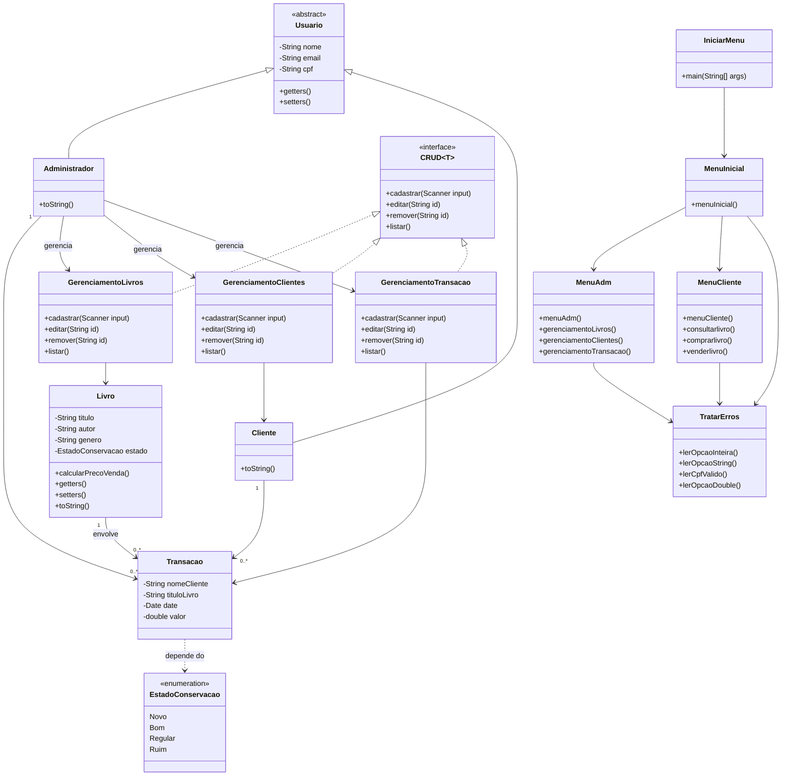

```mermaid
classDiagram
    %% ===================== ENTIDADES =====================
    class Livro {
        -String titulo
        -String autor
        -String genero
        -EstadoConservacao estado
        +calcularPrecoVenda()
        +getters()
        +setters()
        +toString()
    }

    class Usuario {
        <<abstract>>
        -String nome
        -String email
        -String cpf
        +getters()
        +setters()
    }

    class Administrador {
        +toString()
    }

    class Cliente {
        +toString()
    }

    class Transacao {
        -String nomeCliente 
	    -String tituloLivro 
	    -Date date
	    -double valor
    }

    class EstadoConservacao {
        <<enumeration>>
        Novo
        Bom
        Regular
        Ruim
    }

    %% ===================== INTERFACE CRUD =====================
    class CRUD~T~ {
        <<interface>>
        +cadastrar(Scanner input)
        +editar(String id)
        +remover(String id)
        +listar()
    }

    %% ===================== GERENCIAMENTO =====================
    class GerenciamentoLivros {
        +cadastrar(Scanner input)
        +editar(String id)
        +remover(String id)
        +listar()  
    }

    class GerenciamentoClientes {
        +cadastrar(Scanner input)
        +editar(String id)
        +remover(String id)
        +listar()
    }

    class GerenciamentoTransacao {
        +cadastrar(Scanner input)
        +editar(String id)
        +remover(String id)
        +listar()
    }

    %% ===================== LÓGICA DO SISTEMA =====================
    class IniciarMenu {
        +main(String[] args)
    }

    class MenuInicial {
        +menuInicial()
    }

     class MenuAdm {
        +menuAdm()
        +gerenciamentoLivros()
        +gerenciamentoClientes()
        +gerenciamentoTransacao()
    }

    class MenuCliente {
        +menuCliente()
        +consultarlivro()
        +comprarlivro()
        +venderlivro()
    }

    class TratarErros {
        +lerOpcaoInteira()
        +lerOpcaoString()
        +lerCpfValido()
        +lerOpcaoDouble()
    }

    %% ===================== RELACIONAMENTOS =====================
    Usuario <|-- Administrador
    Usuario <|-- Cliente

    Livro "1" --> "0..*" Transacao : envolve
    Cliente "1" --> "0..*" Transacao
    Administrador "1" --> "0..*" Transacao
    Transacao ..> EstadoConservacao : depende do

    GerenciamentoLivros --> Livro
    GerenciamentoClientes --> Cliente
    GerenciamentoTransacao --> Transacao

    Administrador --> GerenciamentoLivros : gerencia
    Administrador --> GerenciamentoClientes : gerencia
    Administrador --> GerenciamentoTransacao : gerencia

    CRUD <|.. GerenciamentoLivros
    CRUD <|.. GerenciamentoClientes
    CRUD <|.. GerenciamentoTransacao

    IniciarMenu --> MenuInicial
    MenuInicial --> MenuAdm
    MenuInicial --> MenuCliente
    MenuInicial --> TratarErros
    MenuAdm --> TratarErros
    MenuCliente --> TratarErros
```