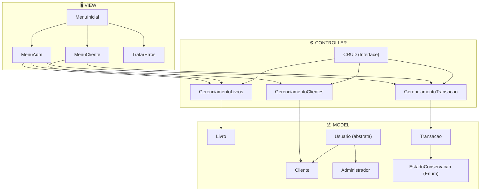

```mermaid
flowchart TB
    %% ==================== CAMADAS PRINCIPAIS ====================
    subgraph VIEW["🖥️ VIEW "]
        MI["MenuInicial"]
        MA["MenuAdm"]
        MC["MenuCliente"]
        TE["TratarErros"]
    end

    subgraph CONTROLLER["⚙️ CONTROLLER "]
        GL["GerenciamentoLivros"]
        GC["GerenciamentoClientes"]
        GT["GerenciamentoTransacao"]
        CRUD["CRUD<T> (Interface)"]
    end

    subgraph MODEL["📦 MODEL "]
        L["Livro"]
        C["Cliente"]
        A["Administrador"]
        U["Usuario (abstrata)"]
        T["Transacao"]
        E["EstadoConservacao (Enum)"]
    end

    %% ==================== RELAÇÕES ENTRE CAMADAS ====================
    MI --> MA
    MI --> MC
    MI --> TE
    MA --> GL
    MA --> GC
    MA --> GT
    MC --> GL
    MC --> GT
    GL --> L
    GC --> C
    GT --> T
    T --> E

    %% Herança
    U --> A
    U --> C

    %% Interface CRUD
    CRUD --> GL
    CRUD --> GC
    CRUD --> GT

```
