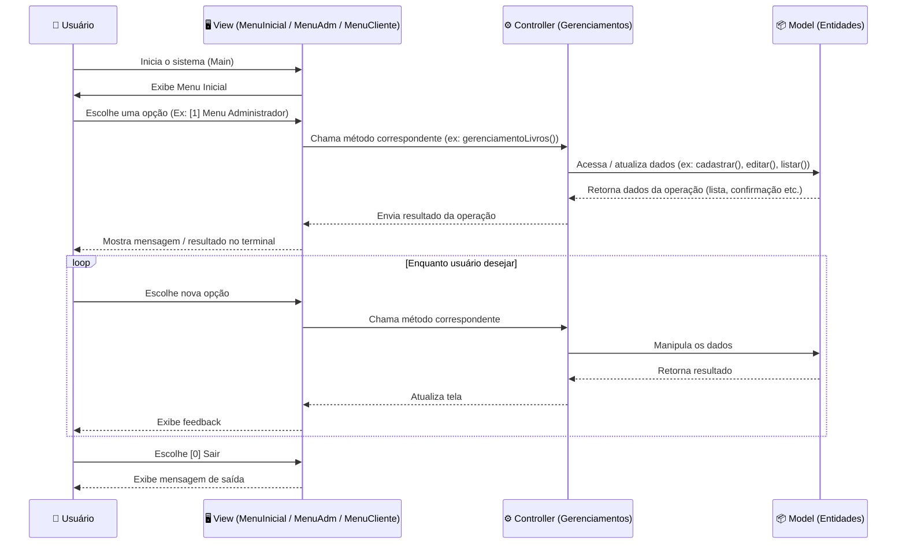

```mermaid
sequenceDiagram
    participant U as 👩 Usuário
    participant VI as 🖥️ View (MenuInicial / MenuAdm / MenuCliente)
    participant C as ⚙️ Controller (Gerenciamentos)
    participant M as 📦 Model (Entidades)

    %% ======== INÍCIO DO FLUXO ========
    U->>VI: Inicia o sistema (Main)
    VI->>U: Exibe Menu Inicial

    U->>VI: Escolhe uma opção (Ex: [1] Menu Administrador)

    %% ======== CAMADA CONTROLLER ========
    VI->>C: Chama método correspondente (ex: gerenciamentoLivros())
    C->>M: Acessa / atualiza dados (ex: cadastrar(), editar(), listar())
    M-->>C: Retorna dados da operação (lista, confirmação etc.)

    %% ======== RETORNO À VIEW ========
    C-->>VI: Envia resultado da operação
    VI-->>U: Mostra mensagem / resultado no terminal

    %% ======== LOOP DE OPERAÇÕES ========
    loop Enquanto usuário desejar
        U->>VI: Escolhe nova opção
        VI->>C: Chama método correspondente
        C->>M: Manipula os dados
        M-->>C: Retorna resultado
        C-->>VI: Atualiza tela
        VI-->>U: Exibe feedback
    end

    U->>VI: Escolhe [0] Sair
    VI-->>U: Exibe mensagem de saída
```
